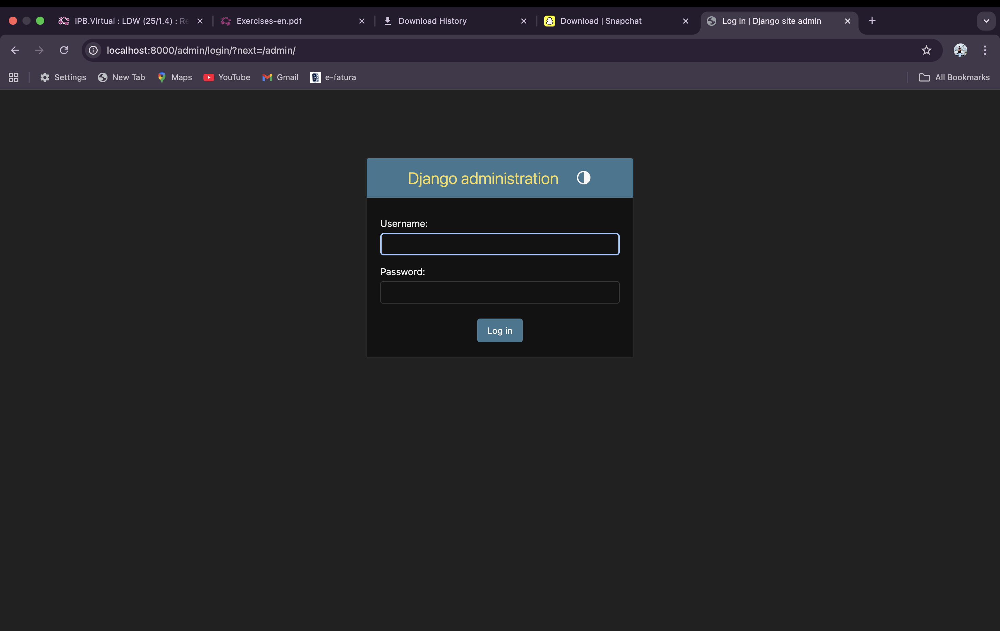
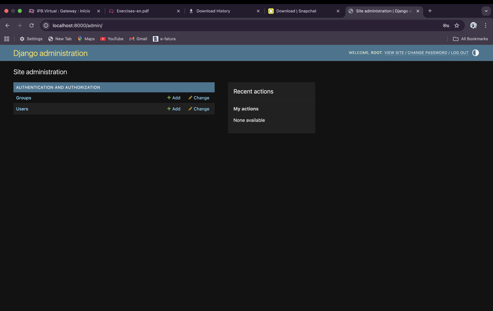
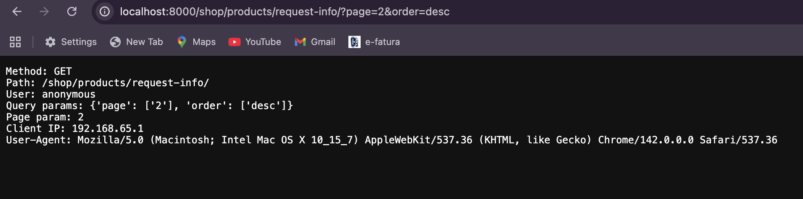
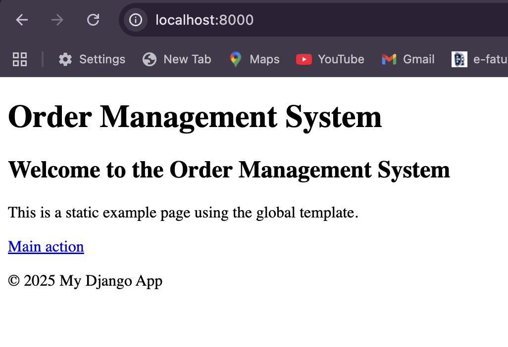
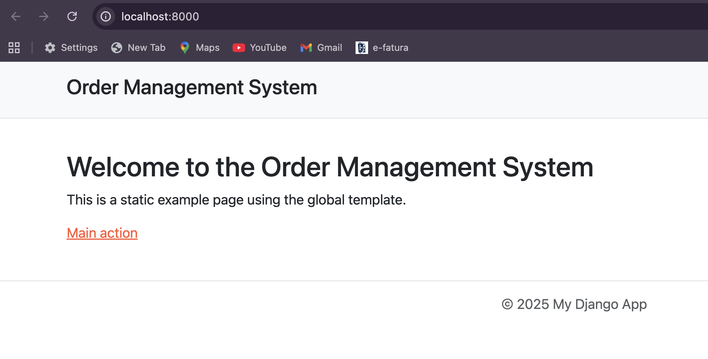
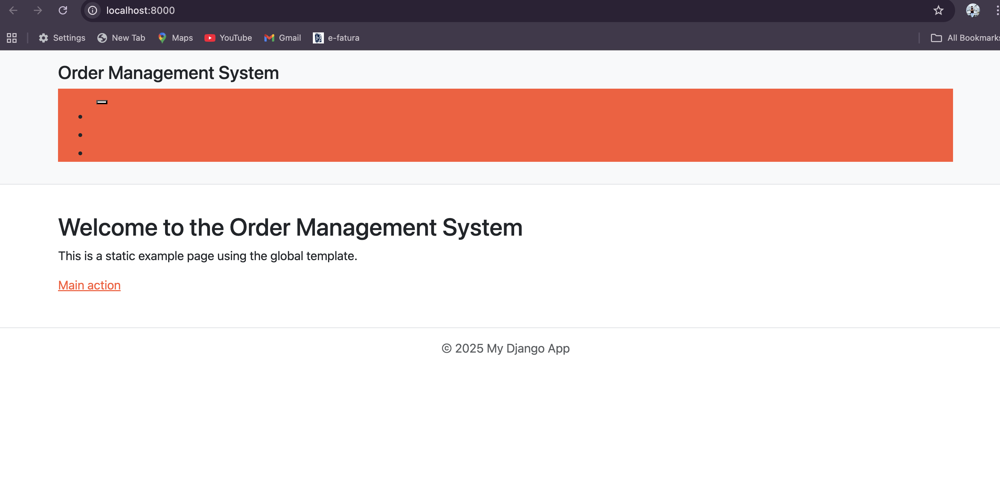
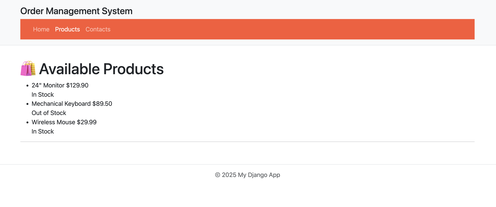
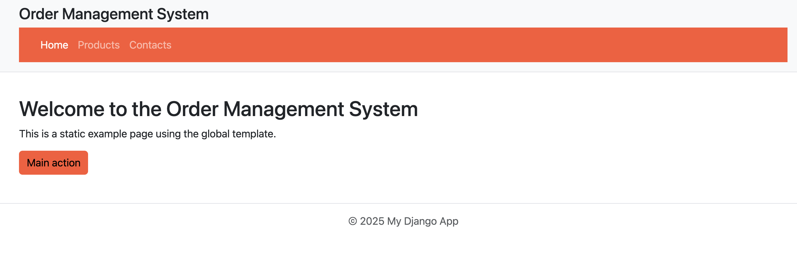
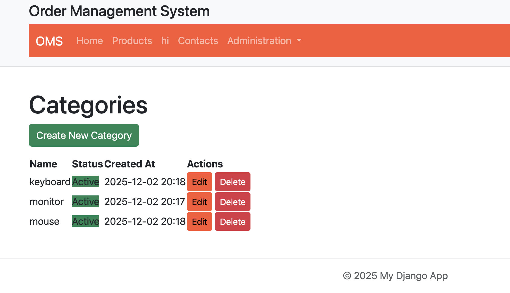
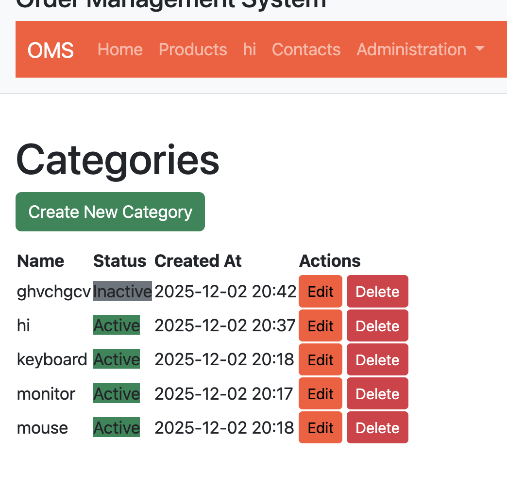

# Exercise 26

### Exercise c
                  List of relations. 
 Schema |            Name            | Type  | Owner.   
--------+----------------------------+-------+-------  
 public | auth_group                 | table | oms     
 public | auth_group_permissions     | table | oms  
 public | auth_permission            | table | oms.    
 public | auth_user                  | table | oms.   
 public | auth_user_groups           | table | oms.    
 public | auth_user_user_permissions | table | oms     
 public | django_admin_log           | table | oms     
 public | django_content_type        | table | oms.  
 public | django_migrations          | table | oms.  
 public | django_session             | table | oms.  
(10 rows)

